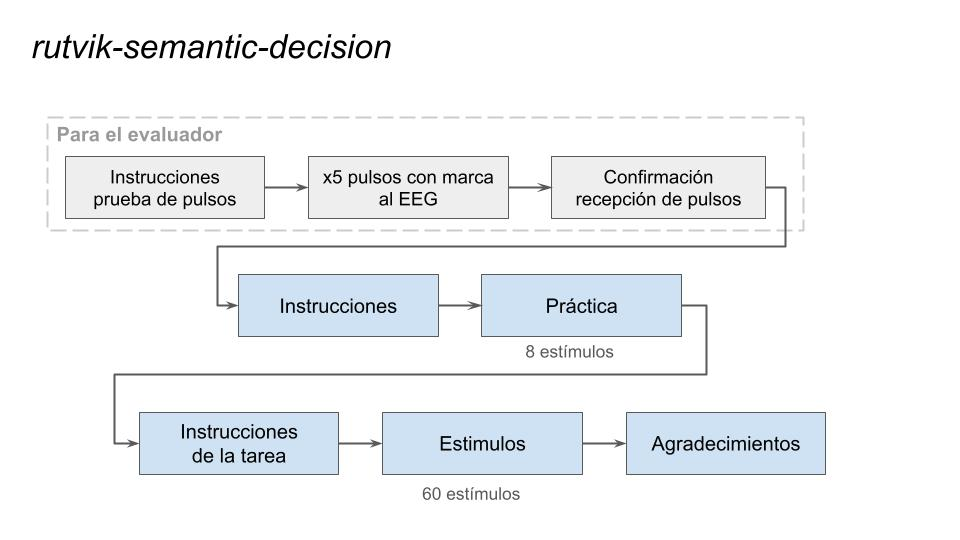

# Paradigma de Decisión Léxica

El **Paradigma de Decisión Léxica** fue desarrollado utilizando PsychoPy Builder. Está diseñado para evaluar la capacidad de un paciente para distinguir entre palabras familiares y no familiares mientras tiene implantado un iEEG. El paradigma también envía marcadores al dispositivo de grabación para coordinar la sincronización de las señales.

El paradigma sigue estos pasos:
1. **Instrucciones**: Se presentan instrucciones para probar la conexión con el aparato de registro.
2. **Presentación de Pulsos**: Se envían 5 pulsos al aparato de registro con sonido simultaneo.
3. **Confirmación**: Aparece una pantalla para confirmar la recepción de los pulsos.
4. **Instrucciones**: El paradigma continúa con instrucciones para el paciente.
5. **Práctica**: El paciente debe decidir si las palabras presentadas en pantalla resultan familiares o no. Estimulos de práctica.
6. **Instrucciones**: Instrucciones para el paciente.
7. **Decision Lexica**: El paciente debe decidir si las palabras presentadas en pantalla resultan familiares o no.
8. **Agradecimientos**: Se muestra una pantalla de agradecimiento al final.

Los estímulos se presentan luego de una cruz de fijación de 0.8s por 4.5s. Mientras se ve el estimulo el usuario puede responder con las teclas.

## Interacción con Arduino
Cada vez que se presenta un estímulo, el programa envía el carácter 'P' a un dispositivo Arduino. El Arduino procesa este carácter y responde generando un pulso. Esta elección de diseño permite que el Arduino sea controlado a través de la comunicación serial tanto desde Python como desde MATLAB, sin necesidad de reprogramarlo según el lenguaje de desarrollo. El paradigma no funcionará si no puede establecer comunicación serial.

## Requisitos

Antes de utilizar este paradigma, los requisitos necesarios son:
- Python 3.x
- Arduino Uno o un dispositivo similar
- Arduino IDE (para cargar código en el Arduino, si es necesario)

## Uso

1. **Configuración del Arduino (si aplica):**
   - Conectar tu Arduino Uno al puerto USB de tu computadora.
   - Cargar el código proporcionado que se encuentra en la carpeta `resources` al Arduino utilizando el Arduino IDE. Este código permite que el Arduino genere pulsos en respuesta a un comando.

2. **Ejecución:**
   Abrir el .psyexp y tocar la flecha verde para correr el experimento